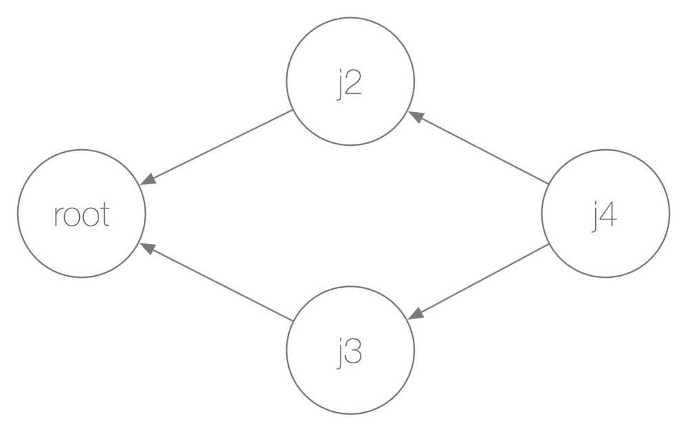

# DependentJobs for Kubernetes

This is a POC for `DependentJobs` for Kubernetes. Currently, a simulator exists that you can use to toy around with the semantics.

## Intro

- The dependency of jobs is represented in a so called *call graph*. It consists of two or more jobs with exactly one having the ID `root`. This is the entry point, that is, from where the call graph is executed.
- Each job can have none, one or more dependent jobs.
- In the simulator, jobs have a random runtime that can be influenced by `MinExecTimeMs` and `MaxExecTimeMs` in [job.go](https://github.com/mhausenblas/dependentjobs/blob/master/job.go).


Let's have a look at a concrete example of a call graph with four jobs: `root`, `j2`, `j3`, and `j4`:



- The `root` job has two dependent jobs: `j2` and `j3`.
- The job `j4` has two upstream jobs, `j2` and `j3`.
- When we execute this call graph, we would expect that first `root` is run, then either `j2` or `j3` and, once both `j2` and `j3` have completed, `j4` is run.

A call graph can manually be constructed like so:

```
dj := New()
dj.Add("root", "job 1", 0)
dj.Add("j2", "job 2", 1)
dj.AddDependents("root", "j2")
```

You can also create a call graph using `FromFile("test.yaml")` with `test.yaml` as a manifest in YAML format:

```yaml
root:
  id:   root
  name: job 1
  deps:
  - j2
j2:
  id:   j2
  name: job 2
```

The above is equivalent to the manually created call graph, above.

To execute a call graph, do:

```
dj.Run()
dj.Complete()
fmt.Printf("Call sequence: %v\n", dj.CallSeq())
```

Once `Complete()` has been called, you can read out the sequence in which the jobs have been executed using `CallSeq()`.

## Usage

There are currently no binaries shipped, so you need to have at least Go 1.8 installed and after cloning this repo, you can build and run it like so:

```bash
$ go install
$ dependentjobs
Creating call graph:
<ID: root, Every: 1, Status: scheduled, Exectime: 0s, Deps: [j2]>
<ID: j2, Every: 1, Status: scheduled, Exectime: 0s, Deps: []>

Running jobs in call graph:
1507732640841832497| Launched: <ID: root, Every: 1, Status: scheduled, Exectime: 0s, Deps: [j2]>
1507732640877146055| Executed: <ID: root, Every: 1, Status: completed, Exectime: 32ms, Deps: [j2]>
1507732640877260720| Launched: <ID: j2, Every: 1, Status: scheduled, Exectime: 0s, Deps: []>
1507732640929893882| Executed: <ID: j2, Every: 1, Status: completed, Exectime: 51ms, Deps: []>
Call sequence: [root 1507732640841862606 1507732640877144185 j2 1507732640877272086 1507732640929889903]
```

Note: if you want to execute a specific example, you can pass it in as an argument, for example:

```bash
$ dependentjobs examples/tree.yaml
```

Note: there's also a first attempt for cron job support in `main.go`, in the function `djcron()`.

## Test cases

There are a number of test cases for simple (non-cron) call graphs defined in `examples/`:

- [one-dep.yaml](examples/one-dep.yaml), a root with one dependent job.
- [two-dep.yaml](examples/two-dep.yaml), a root with two dependent jobs.
- [diamond.yaml](examples/diamond.yaml), a root with two dependent jobs and a final job that dependents on the previous jobs.
- [deep.yaml](examples/deep.yaml), like the previous, with one further job as final job that also depends on the root.
- [seq.yaml](examples/seq.yaml), a strict sequence of jobs.
- [tree.yaml](examples/tree.yaml), a root with two branches (`j2 -> j4` and `j3 -> j5`)

To run all test cases, do:

```bash
$ go test
```

To run a specific test case, for example, the tree:

```bash
$ go test -v -run TestTree .
```
